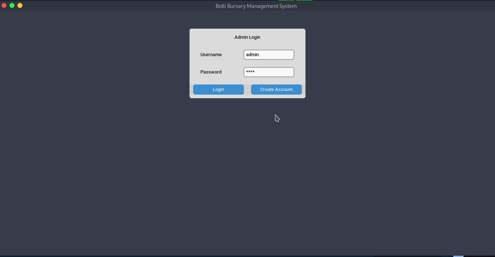
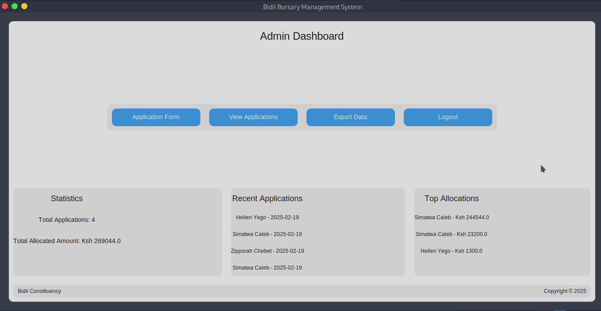

# bursary-management-system
Bursary management system for Bidii

## Demos
| Panel  | Screenshot |
|--------|------------|
| Login |  |
| Dashboard |  |

## Prerequisite

- [x] [Python>=3.13](https://python.org)

## Installation

Clone repository, enter project directory and install dependencies
```sh
git clone https://github.com/AlphaBei254/bursary-management-system.git
cd bursary-management-system
pip install -r requirements.txt
```

> [!TIP]
> Alternatively, you can download standalone application  for your system from [here](https://github.com/AlphaBei254/bursary-management-system/releases/latest).

## Usage
Excecute the [main.py](main.py) file

```
python main.py
```

## License

- [x] [MIT License](LICENSE)